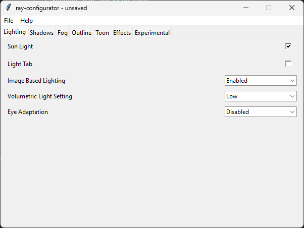

# ray-configurator
GUI for configurating ray-mmd

This configuration utility allows you to change settings of ray-mmd without needing to know how it works or what everything means. It has helpful tooltips and a lightweight GUI.

**Only works with ray-mmd's dev branch currently, I have not yet implemented mappings for the other versions.**

## Screenshot

## Things to add
* Code cleanup
* Translations
* Support ray_advanced.conf
* Detect ray-mmd version and change config mappings to match

## License
[MIT](LICENSE)